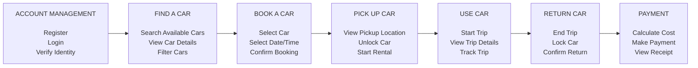

# LAB-02-Car-share-Store-Map
#

## 1. 2D Story Map

## 2. Walking Skeleton MVP

The Walking Skeleton represents the smallest end-to-end version of the
peer-to-peer car-sharing application.

### MVP User Journey

Register/Login  
↓  
Search Available Car  
↓  
View Car  
↓  
Book Car  
↓  
Pick Up Car  
↓  
Use Car  
↓  
Return Car  
↓  
Make Payment

## 3. MVP Features

- User registration and login
- Search available cars
- View car details
- Select a car
- Select date and time
- Confirm booking
- View pickup location
- Start rental
- End rental
- Calculate rental cost
- Make payment

## 4. Future Features

- Advanced car filters
- Ratings and reviews
- Notifications
- Favourite cars
- Trip history
- Promotional codes
- Referral system
- Advanced GPS tracking
- Insurance options
