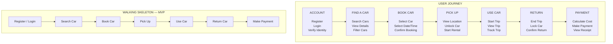

# LAB-02-Car-share-Store-Map and Walking Skeleton MVP

```mermaid
flowchart TB

    subgraph JOURNEY["USER JOURNEY"]
        direction LR

        A["ACCOUNT<br/><br/>Register<br/>Login<br/>Verify Identity"]
        B["FIND A CAR<br/><br/>Search Cars<br/>View Details<br/>Filter Cars"]
        C["BOOK CAR<br/><br/>Select Car<br/>Select Date/Time<br/>Confirm Booking"]
        D["PICK UP<br/><br/>View Location<br/>Unlock Car<br/>Start Rental"]
        E["USE CAR<br/><br/>Start Trip<br/>View Trip<br/>Track Trip"]
        F["RETURN<br/><br/>End Trip<br/>Lock Car<br/>Confirm Return"]
        G["PAYMENT<br/><br/>Calculate Cost<br/>Make Payment<br/>View Receipt"]

        A --> B --> C --> D --> E --> F --> G
    end

    subgraph MVP["WALKING SKELETON — MVP"]
        direction LR

        M1["Register / Login"]
        M2["Search Car"]
        M3["Book Car"]
        M4["Pick Up"]
        M5["Use Car"]
        M6["Return Car"]
        M7["Make Payment"]

        M1 --> M2 --> M3 --> M4 --> M5 --> M6 --> M7
    end
```

