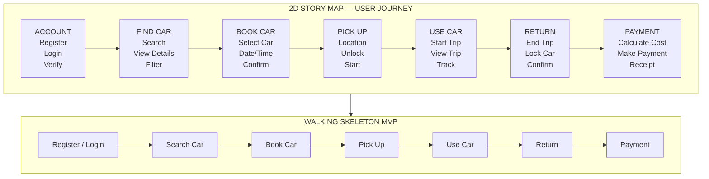

# LAB 02 — Car-Share Story Map and Walking Skeleton MVP

```mermaid
flowchart TB

    subgraph STORY["2D STORY MAP — USER JOURNEY"]
        direction LR

        A["ACCOUNT<br/>Register<br/>Login<br/>Verify"]
        B["FIND CAR<br/>Search<br/>View Details<br/>Filter"]
        C["BOOK CAR<br/>Select Car<br/>Date/Time<br/>Confirm"]
        D["PICK UP<br/>Location<br/>Unlock<br/>Start"]
        E["USE CAR<br/>Start Trip<br/>View Trip<br/>Track"]
        F["RETURN<br/>End Trip<br/>Lock Car<br/>Confirm"]
        G["PAYMENT<br/>Calculate Cost<br/>Make Payment<br/>Receipt"]

        A --> B --> C --> D --> E --> F --> G
    end

    subgraph MVP["WALKING SKELETON MVP"]
        direction LR

        M1["Register / Login"]
        M2["Search Car"]
        M3["Book Car"]
        M4["Pick Up"]
        M5["Use Car"]
        M6["Return"]
        M7["Payment"]

        M1 --> M2 --> M3 --> M4 --> M5 --> M6 --> M7
    end

    STORY --> MVP
```
